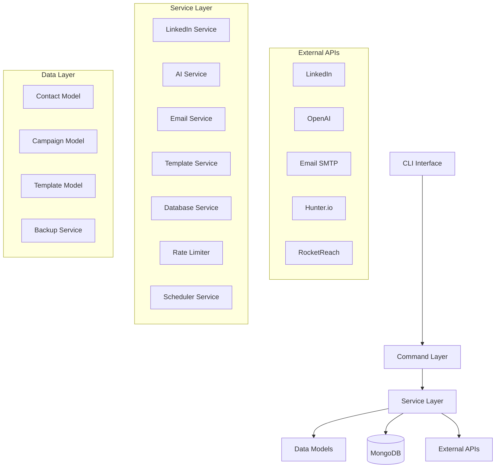

# Architecture Documentation

## System Overview

The Cold Email Bot is a comprehensive Node.js application designed for automated LinkedIn networking and cold email campaigns. The system follows a modular, service-oriented architecture with clear separation of concerns.

## High-Level Architecture



## Core Components

### 1. CLI Interface (`src/cli.ts`)

The main entry point that provides a command-line interface using Commander.js.

**Responsibilities:**
- Parse command-line arguments
- Route commands to appropriate handlers
- Provide help and usage information
- Handle global error management

**Key Features:**
- Interactive prompts for user input
- Colored output and progress indicators
- Command validation and error handling
- Environment configuration management

### 2. Command Layer (`src/commands/`)

Individual command implementations that orchestrate service calls.

**Available Commands:**
- `start`: Launch new campaigns
- `search`: Find and scrape LinkedIn profiles
- `connect`: Send connection requests
- `followup`: Process follow-up emails
- `dashboard`: Display real-time monitoring
- `config`: Manage configuration
- `templates`: Template management
- `contacts`: Contact management
- `test`: Service testing and validation

### 3. Service Layer (`src/services/`)

Core business logic services that handle specific functionality.

#### LinkedInService (`src/services/linkedinService.ts`)

**Purpose:** LinkedIn automation and interaction

**Key Features:**
- Browser automation with Playwright
- 2FA support with manual code entry
- Session persistence using cookies
- Profile scraping and data extraction
- Connection request automation
- Rate limiting and jail detection
- Human-like behavior simulation

**Architecture:**
```typescript
class LinkedInService {
  private browser: Browser
  private context: BrowserContext
  private page: Page
  private limitTracker: LimitTracker
  private smartTiming: SmartTiming
  
  async login(credentials: LinkedInCredentials): Promise<boolean>
  async searchRecruiters(filters: SearchFilters): Promise<string[]>
  async scrapeProfile(profileUrl: string): Promise<RecruiterProfile>
  async sendConnectionRequest(profileUrl: string, message?: string): Promise<ConnectionRequestResult>
}
```

#### AIService (`src/services/aiService.ts`)

**Purpose:** AI-powered message personalization using OpenAI

**Key Features:**
- OpenAI GPT integration
- Message template management
- Profile analysis for talking points
- Tone control (professional, friendly, enthusiastic)
- Length validation and optimization
- Retry logic with exponential backoff

**Architecture:**
```typescript
class AIService {
  private openai: OpenAI
  private defaultTemplates: TemplateCollection
  private toneConfigs: ToneConfiguration
  
  async generatePersonalizedMessage(
    recruiterProfile: IRecruiterProfile,
    templateType: TemplateType,
    userInfo: IUserInfo,
    options: IMessageOptions
  ): Promise<string>
  
  async analyzeRecruiterProfile(
    recruiterProfile: IRecruiterProfile,
    userInfo: IUserInfo
  ): Promise<string[]>
}
```

#### EmailService (`src/services/emailService.ts`)

**Purpose:** Email sending and management

**Key Features:**
- SMTP integration (Gmail, Outlook, Custom)
- HTML and text email templates
- Email tracking with pixels
- Unsubscribe handling
- Rate limiting and bulk sending
- Email validation and verification
- Integration with email lookup services

**Architecture:**
```typescript
class EmailService {
  private transporter: Transporter
  private rateLimiter: EmailRateLimiter
  private emailLookupService: EmailLookupService
  
  async sendEmail(emailData: IEmailData): Promise<IEmailResult>
  async sendBulkEmails(emails: IEmailData[], options: IBulkEmailOptions): Promise<IEmailResult[]>
  async trackEmailOpen(trackingId: string): Promise<void>
  async handleUnsubscribe(trackingId: string): Promise<void>
}
```

#### TemplateService (`src/services/templateService.ts`)

**Purpose:** Message template management

**Key Features:**
- CRUD operations for templates
- Variable validation and substitution
- Template testing and preview
- Usage tracking and analytics
- Category and tag organization

#### DatabaseService (`src/services/databaseService.ts`)

**Purpose:** Database operations and data management

**Key Features:**
- MongoDB connection management
- CRUD operations for all models
- Data validation and sanitization
- Query optimization and indexing
- Backup and recovery operations

#### RateLimiter (`src/services/rateLimiter.ts`)

**Purpose:** Rate limiting and safety controls

**Key Features:**
- LinkedIn daily limits tracking
- Email sending rate limiting
- Configurable limits and windows
- Automatic reset handling
- Safety enforcement

#### SchedulerService (`src/services/schedulerService.ts`)

**Purpose:** Automated scheduling and follow-up management

**Key Features:**
- Cron-based scheduling
- Follow-up sequence management
- Optimal timing calculation
- Campaign automation
- Reminder system

### 4. Data Models (`src/models/`)

MongoDB data models using Mongoose ODM.

#### Contact Model
```typescript
interface IContact {
  name: string
  email?: string
  linkedinUrl: string
  company: string
  position: string
  industry?: string
  status: ContactStatus
  campaignId: string
  connectionDate?: Date
  lastContact?: Date
  notes?: string
  tags?: string[]
  emailLookup?: EmailLookupData
}
```

#### Campaign Model
```typescript
interface ICampaign {
  name: string
  description?: string
  targetCriteria: TargetCriteria
  status: CampaignStatus
  contacts: string[]
  templates: string[]
  statistics: CampaignStatistics
  createdAt: Date
  updatedAt: Date
}
```

#### Template Model
```typescript
interface ITemplate {
  name: string
  type: TemplateType
  content: string
  variables: TemplateVariable[]
  category: string
  tags?: string[]
  usageCount: number
  successRate?: number
  createdAt: Date
  updatedAt: Date
}
```

### 5. Configuration Management (`src/config/`)

Centralized configuration handling.

**Features:**
- Environment variable management
- Database configuration
- Error handling configuration
- Service-specific settings

### 6. Utilities (`src/utils/`)

Helper functions and utilities.

**Key Utilities:**
- `logger.ts`: Winston-based logging system
- `winstonLogger.ts`: Advanced logging configuration
- `debugMode.ts`: Debug mode management
- `timing.ts`: Smart timing utilities
- `errorHandler.ts`: Centralized error handling

## Data Flow

### 1. Campaign Initialization
```
User Input → CLI → Start Command → LinkedIn Service → Profile Search → Database Storage
```

### 2. Connection Request Flow
```
Campaign Data → Connection Command → LinkedIn Service → Rate Limiter → Browser Automation → Result Storage
```

### 3. Email Campaign Flow
```
Contact Data → Follow-up Command → Email Service → Template Rendering → SMTP Sending → Tracking
```

### 4. AI Message Generation
```
Profile Data → AI Service → OpenAI API → Message Generation → Template Integration → Validation
```

## Security and Safety

### Rate Limiting
- **LinkedIn Limits**: 20 connections/day, 10 messages/day
- **Email Limits**: 50 emails/hour
- **API Limits**: Respects OpenAI and email lookup API limits

### Error Handling
- **Graceful Degradation**: Services continue operating when non-critical errors occur
- **Retry Logic**: Automatic retry with exponential backoff
- **Error Reporting**: Comprehensive error logging and notification
- **Jail Detection**: LinkedIn restriction detection and response

### Data Protection
- **Environment Variables**: Sensitive data stored in environment variables
- **Database Encryption**: Optional encryption for sensitive data
- **Backup System**: Automated database backups
- **Access Control**: Service-level access restrictions

## Performance Optimization

### Caching Strategy
- **Session Persistence**: LinkedIn cookies cached to avoid repeated logins
- **Email Lookup Cache**: API results cached to reduce costs
- **Template Cache**: Frequently used templates cached in memory

### Database Optimization
- **Indexing**: Strategic indexes on frequently queried fields
- **Connection Pooling**: MongoDB connection pooling
- **Query Optimization**: Efficient queries with proper projections

### Resource Management
- **Browser Management**: Proper browser instance cleanup
- **Memory Management**: Regular garbage collection and memory monitoring
- **Process Monitoring**: Health checks and resource monitoring

## Scalability Considerations

### Horizontal Scaling
- **Stateless Services**: Services designed to be stateless where possible
- **Database Sharding**: MongoDB sharding support
- **Load Balancing**: Multiple instance support

### Vertical Scaling
- **Resource Monitoring**: CPU and memory usage tracking
- **Performance Metrics**: Response time and throughput monitoring
- **Auto-scaling**: Automatic resource adjustment based on load

## Monitoring and Observability

### Logging
- **Structured Logging**: JSON-formatted logs with context
- **Log Levels**: Debug, Info, Warn, Error levels
- **Log Rotation**: Automatic log file rotation and cleanup

### Metrics
- **Performance Metrics**: Response times, success rates, error rates
- **Business Metrics**: Campaign performance, conversion rates
- **System Metrics**: CPU, memory, disk usage

### Health Checks
- **Service Health**: Individual service health monitoring
- **Database Health**: MongoDB connection and performance monitoring
- **External API Health**: Third-party service availability monitoring

## Deployment Architecture

### Development Environment
```
Local Machine → MongoDB (Docker) → External APIs
```

### Production Environment
```
Load Balancer → Multiple App Instances → MongoDB Cluster → External APIs
```

### Containerization
- **Docker Support**: Dockerfile for containerized deployment
- **Environment Configuration**: Environment-specific configurations
- **Health Checks**: Container health monitoring

## Integration Points

### External APIs
- **LinkedIn**: Browser automation and scraping
- **OpenAI**: AI-powered message generation
- **Email Providers**: SMTP integration (Gmail, Outlook, Custom)
- **Email Lookup**: Hunter.io and RocketReach integration

### Data Sources
- **MongoDB**: Primary data storage
- **File System**: Logs, backups, and temporary files
- **Environment Variables**: Configuration and secrets

## Future Enhancements

### Planned Features
- **Web Dashboard**: Web-based UI for campaign management
- **Advanced Analytics**: Detailed reporting and insights
- **Multi-Platform Support**: Support for additional social platforms
- **Machine Learning**: Improved targeting and personalization

### Technical Improvements
- **Microservices**: Break down into smaller, focused services
- **Event-Driven Architecture**: Implement event sourcing and CQRS
- **GraphQL API**: Add GraphQL API for external integrations
- **Real-time Updates**: WebSocket support for real-time updates

## Best Practices

### Code Organization
- **Single Responsibility**: Each service has a single, well-defined responsibility
- **Dependency Injection**: Services receive dependencies through constructors
- **Interface Segregation**: Small, focused interfaces
- **Error Boundaries**: Proper error handling at service boundaries

### Testing Strategy
- **Unit Tests**: Individual service testing
- **Integration Tests**: Service integration testing
- **End-to-End Tests**: Complete workflow testing
- **Mock Services**: External service mocking for testing

### Documentation
- **API Documentation**: Comprehensive service documentation
- **Code Comments**: Inline code documentation
- **Architecture Documentation**: System design documentation
- **User Guides**: End-user documentation and examples
